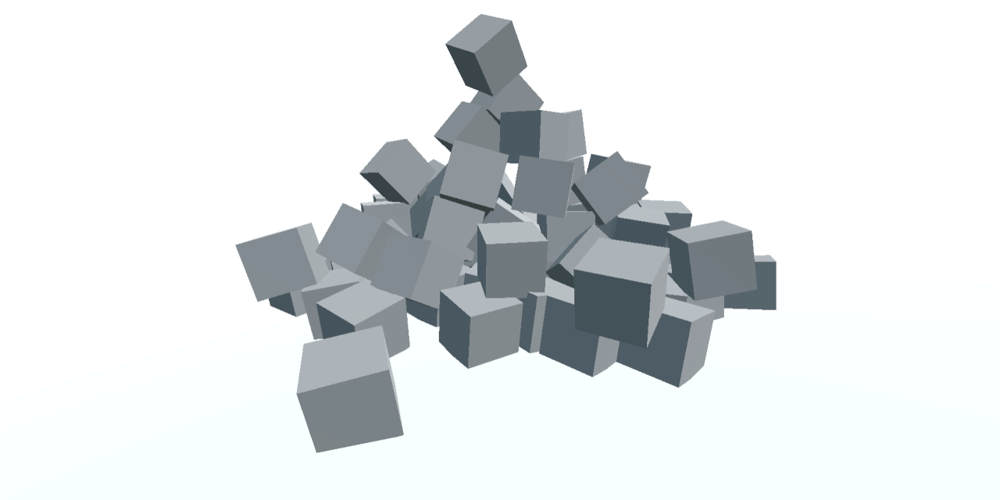

# Godot WebGL Loading Test



[](https://github.com/JohannesDeml/Godot-WebGL-LoadingTest/releases) [](https://godotengine.org/download/archive/4.1.2-stable/)

*Testing Godot's WebGL size and loading times*

* [Overview page of all builds](https://deml.io/experiments/godot-webgl/)
* [Implementation in Unity](https://github.com/JohannesDeml/UnityWebGL-LoadingTest)
* [Godot Forum Thread](https://forum.godotengine.org/t/godot-web-loading-test/105502)


## Features

* Responsive template layout
* Rich text console and BBCode parsing
* Run commands from the console
* Support common browser shortcuts (ctrl+t, F12, ...)
* Automatic CI builds
  * Brotli & Gzip pre-compression
  * [wasm-opt](https://github.com/JohannesDeml/binaryen-wasm-opt) to reduce wasm size
  * Automatic server upload of builds


### Release WebGL2

Version | Size | Link
--- | --- | ---
4.4.0 | 6.16 MB | https://deml.io/experiments/godot-webgl/4.4.0-webgl2
4.3.0 | 5.35 MB | https://deml.io/experiments/godot-webgl/4.3.0-webgl2

### Debug WebGL2

Version | Size | Link
--- | --- | ---
4.4.0 | 6.72 MB | https://deml.io/experiments/godot-webgl/4.4.0-webgl2-debug
4.3.0 | 5.81 MB | https://deml.io/experiments/godot-webgl/4.3.0-webgl2-debug

## Platform Compatibility

| Platform   | Chrome | Firefox | Edge | Safari |
| ---------- | :----: | :-----: | :--: | :----: |
| Windows 10 |   ✔️    |    ✔️    |  ✔️   |   ➖    |
| Linux      |   ✔️    |    ✔️    |  ✔️   |   ➖    |
| Mac        |   ✔️    |    ✔️    |  ✔️   |   ✔️    |
| Android    |   ✔️    |    ✔️    |  ✔️   |   ➖    |
| iOS        |   ✔️    |    ✔️    |  ✔️   |   ✔️    |

✔️ *: Supported* | ⚠️ *: Warning , see below* | ❌ *: not supported* | ➖ *: Not applicable*

## Notes

* I'm mostly developing with Unity and the comparison to my [unity webgl project](https://github.com/JohannesDeml/UnityWebGL-LoadingTest) might not be fair, since I have a lot more experience with Unity development. However, I tried getting a similar feature set and the same graphics settings to be able to make a fair comparison of 3D & physics performance on WebGL.
* Exporting the project is a bliss compared to Unity, it is finished in a second while for Unity it takes 10+ minutes on my laptop.
* Loading times are really long for godot (compared to unity)
* I didn't find any way to build for WebGL 1 or WebGPU, if this exists and I just missed it, please let me know.
* So far this project does not use custom export templates (I got my hands dirty with [this version](https://deml.io/experiments/godot-webgl/4.1.2-custom-template)) since I would need some custom logic to set up everything for CI with custom templates. However it seems like this is worth another look. For more information on how to use custom export templates check out [this great blog post](https://popcar.bearblog.dev/how-to-minify-godots-build-size/).
* Build size increased significantly from Godot 4.3 to Godot 4.4 (0.8MB / +15%). Maybe it is about VR support for the web, but that is just a guess.

## Browser Console commands

The script [WebCommands](./godot/Scripts/WebCommands.gd) adds support to call godot functions from the browser console through `godotFunctions.runCommand("COMMAND_NAME",PARAMETERS...)`

Currently the following commands are available:

### [System](./godot/Scripts/WebCommands.gd)
```javascript
runCommand("help") -> Shows all available commands
```

### [CommonWebCommands](./godot/Scripts/CommonWebCommands.gd)
```javascript
runCommand("log_memory") -> Logs current memory usage
runCommand("pause_game") -> Pauses the game
runCommand("print_example") -> Logs an example rich text message to the console (BBCode)
runCommand("print_rich", message: String) -> Logs a rich text message to the console (BBCode)
runCommand("quit") -> Quits the application
runCommand("set_time_scale", scale: float) -> Sets the game time scale
runCommand("toggle_pause") -> Toggles the game pause state
runCommand("unpause_game") -> Unpauses the game
```

## License

* MIT (c) Johannes Deml - see [LICENSE](./LICENSE.md)
