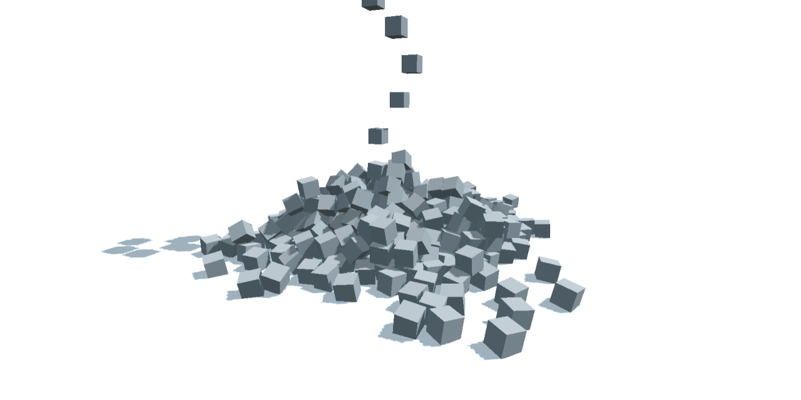

# Godot WebGL Loading Test

 

*Testing Godot's WebGL size and loading times* - 🚧 Work in progress 🚧

* [Overview page of all builds](https://deml.io/experiments/godot-webgl/)
* [Implementation in Unity](https://github.com/JohannesDeml/UnityWebGL-LoadingTest)
* [Godot Forum Thread](https://godotforums.org/d/37304-gzip-brotli-compression-with-custom-template)

## Features

* Physics
* Responsive template layout
* Rich text console and BBCode parsing
* Commands from the console

## Live Demos

### Default
Version | Size | Link
--- | --- | ---
4.1.2 | 27.12 MB | https://deml.io/experiments/godot-webgl/4.1.2-default

### Custom Template
Version | Size | Link
--- | --- | ---
4.1.2 | 25.04 MB | https://deml.io/experiments/godot-webgl/4.1.2-custom-template

### wasm-opt
Version | Size | Link
--- | --- | ---
4.1.2 | 23.13 MB | https://deml.io/experiments/godot-webgl/4.1.2-wasm-opt

### Debug
Version | Size | Link
--- | --- | ---
4.1.2 | 46.84 MB | https://deml.io/experiments/godot-webgl/4.1.2-debug

## Platform Compatibility

| Platform   | Chrome | Firefox | Edge | Safari |
| ---------- | :----: | :-----: | :--: | :----: |
| Windows 10 |   ✔️    |    ✔️    |  ✔️   |   ➖    |
| Linux      |   ✔️    |    ✔️    |  ✔️   |   ➖    |
| Mac        |   ✔️    |    ✔️    |  ✔️   |   ✔️    |
| Android    |   ✔️    |    ✔️    |  ✔️   |   ➖    |
| iOS        |   ✔️    |    ✔️    |  ✔️   |   ✔️    |

✔️ *: Supported* | ⚠️ *: Warning , see below* | ❌ *: not supported* | ➖ *: Not applicable*

*This matrix is for Godot 4.1, other versions might differ*

## Notes

* This is very much work in progress. I'm mostly developing with Unity and the comparison to my [unity webgl project](https://github.com/JohannesDeml/UnityWebGL-LoadingTest) might not be fair, since I have a lot more experience there and also fine-tuned it over the last years.
* Starting the engine takes a long time - with a custom export template that does not include all engine features this should be faster - You can find one [here](https://deml.io/experiments/godot-webgl/4.1.2-custom-template)
* Exporting the project is a bliss compared to Unity, it is finished in a second while for Unity it takes 10+ minutes on my laptop.

## License

* MIT (c) Johannes Deml - see [LICENSE](./LICENSE.md)
